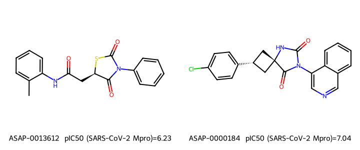
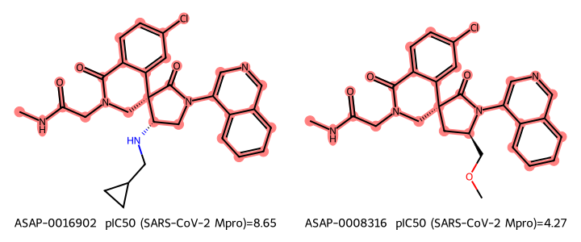

# 2026-07-11 — POTS: an implicit-geometry pharmacophore similarity via optimal transport

- **Date:** 2026-07-11
- **Author:** Steven Kearnes
- **Status:** final
- **Tags:** molecular-similarity, pharmacophore, optimal-transport,
  fused-gromov-wasserstein, ecfp, admet, polaris, benchmark, negative-result
- **License:** [CC BY-SA 4.0](https://creativecommons.org/licenses/by-sa/4.0/)

## Summary

A new molecular similarity, **POTS** (Pharmacophore Optimal-Transport
Similarity), designed to fix three well-known failures of Morgan/ECFP +
Tanimoto for machine learning in drug discovery: size sensitivity, lack of
interpretability, and blindness to the shape/electrostatic ("color") features
that actually govern protein–ligand binding. POTS represents a molecule as a
small cloud of pharmacophore features placed in an **implicit** geometry (a
cheap, conformer-free distance-geometry embedding) and compares two molecules
with the **Fused Gromov–Wasserstein (FGW)** distance. The transport plan is a
soft maximum-common-pharmacophore alignment — directly interpretable and
size-aware. This entry covers the motivation, the method, an implementation in
RDKit + NumPy (no deep learning), and a head-to-head benchmark against ECFP,
RDKit descriptors, and two foundation models on certified Polaris / OpenADMET
ADMET, potency, and affinity tasks.

**Verdict up front:** POTS is genuinely novel and interpretable — its transport
plan is a soft maximum-common-pharmacophore, and it matches molecules across
scaffolds that Tanimoto sees as unrelated — but it **does not beat ECFP/RDKit
descriptors on property-prediction accuracy** across 18 endpoints, and neither
do the foundation models. A deliberately honest, negative-leaning result in the
benchmarking spirit the task called for.

## Motivation: what breaks with ECFP + Tanimoto

The field's default molecular similarity is a Tanimoto coefficient over a
Morgan/ECFP fingerprint: a bag of hashed, atom-centered circular subgraphs. It
is fast, robust, and hard to beat — but it has three structural weaknesses that
matter for ML:

1. **Size sensitivity and un-interpretability.** Tanimoto is
   `|A∩B| / |A∪B|` over bit sets. Small molecules set few bits, so they look
   systematically less similar to everything, and the numeric value depends
   heavily on fingerprint radius, bit length, and atom typing. A "0.4" has no
   fixed chemical meaning.
2. **Global, structure-only matching.** Tanimoto sums evidence over the whole
   molecule and cannot say *which* substructure is shared. Chemists reason about
   a **maximum common substructure (MCS)** plus decorations; Tanimoto has no
   notion of correspondence, so it can be dominated by the "wrong" (peripheral)
   parts of a molecule.
3. **No shape or color.** Protein–ligand recognition is governed by 3D shape
   and the spatial arrangement of pharmacophoric features (H-bond donors and
   acceptors, hydrophobes, aromatics, charges) — not by the 2D bond graph. ECFP
   is purely graph-topological. Generating 3D conformer ensembles and doing
   shape/color overlays (ROCS-style) captures this but is expensive, and recent
   ML work instead trains neural networks to *predict* 3D Shape/Color-Tanimoto
   from the 2D graph (e.g. contrastive GNNs on a "ROCS100k" matrix).

## Design thesis: geometry can be *implicit*

The key observation behind POTS: **Gromov–Wasserstein optimal transport compares
two objects through their internal pairwise-distance matrices, and therefore
never needs a shared coordinate frame.** If we give each molecule an internal
notion of "how far apart are its pharmacophore features," GW will align two
molecules' feature layouts — matching shape and color — without ever embedding
them into a common 3D space. The 3D-ness is *implicit* in the distance matrix.

That lets us sidestep conformer generation entirely. RDKit's distance-geometry
**bounds matrix** (`GetMoleculeBoundsMatrix`) returns per-atom-pair lower/upper
through-space distance bounds derived from bond lengths, angles, and ring
constraints. Its midpoint is a deterministic, conformer-free estimate of real
geometry — it "knows," for example, that the 1,4 atoms of a benzene ring are
~2.8 Å apart, information that pure bond-count (topological) distance discards.
Computing it costs ~1.5 ms/molecule; a single ETKDG conformer costs ~9 ms; a
multi-conformer ROCS overlay costs orders of magnitude more.

## Method: POTS

**1. Pharmacophore cloud.** Using RDKit's `BaseFeatures.fdef` feature factory,
each molecule becomes a set of pharmacophore features, canonicalized to six
chemist-intuitive types: Donor, Acceptor, Aromatic, Hydrophobe, Cation, Anion.
Each feature carries unit mass (normalized to sum 1) — a molecule is a
probability distribution over pharmacophore space.

**2. Implicit geometry.** The intra-molecular feature–feature distance matrix
`D` is computed from the bounds-matrix midpoints (default), or optionally from
shortest-path topology or a single ETKDG conformer (ablation).

**3. Fused Gromov–Wasserstein.** For clouds `A` (types, masses `a`, distances
`Dᴬ`) and `B` (`b`, `Dᴮ`), POTS solves

```text
FGW = min_T  (1−α)·Σ Mᵢⱼ Tᵢⱼ  +  α·Σ |Dᴬᵢₖ − Dᴮⱼₗ|² Tᵢₖ Tⱼₗ
```

over couplings `T` with marginals `a, b`. `M` is a graded pharmacophore
type-cost (same type = 0; related types like donor↔acceptor cheaper than
unrelated). The first term matches **color**; the quadratic term preserves
**shape** (internal distances). `α` trades them off. We solve the entropic
regularization with mirror descent / Sinkhorn projections in pure NumPy, and
debias with the Sinkhorn-divergence correction
`S(A,B) = FGW(A,B) − ½FGW(A,A) − ½FGW(B,B)` so self-similarity is exact.

**Why this addresses the three failures.**

- *Interpretability + MCS:* the coupling `T` is a soft correspondence — a
  fuzzy maximum-common-pharmacophore. You can read off which feature of A maps
  to which of B, and the unmatched mass is an explicit "what's different" term.
- *Size robustness:* FGW is a transport cost with fixed marginals, not a
  set-overlap ratio; the debiasing removes the entropic-bias floor so distances
  are comparable across molecule sizes.
- *Shape + color:* by construction, via the geometry-aware ground metric and
  the fused color/structure objective.

**4. Using POTS with simple models.** Two routes, both sklearn-friendly:

- *Landmark embedding (features):* pick `K` diverse training molecules (MaxMin
  on ECFP); represent every molecule by its vector of FGW distances to the
  landmarks. This is a fixed-length, model-ready feature set for a RandomForest.
  Concatenating cheap global cloud descriptors (type counts + geometric spread)
  gives `POTS+glob`; concatenating with ECFP gives the `ECFP+POTS` hybrid.
- *Direct metric (kernel):* use the similarity **as the Gaussian-process
  covariance**, `k(A,B) = exp(−γ·FGW(A,B))`, PSD-repaired by eigenvalue clipping,
  with `γ` and the noise variance set by the GP log marginal likelihood. The
  identical exact GP with the Tanimoto kernel (already PSD) is the head-to-head
  baseline — the cleanest test of the *similarity itself*. This uses the exact
  full-rank kernel and is therefore run only where the O(n²) FGW matrix is
  affordable (train ≤ 1200); at larger scale the landmark-RF features are the
  recommended way to use POTS. A Nyström (inducing-point) approximation was
  tested to lift this cap but was found to **distort the indefinite FGW kernel**
  — increasing the inducing count improved the (PSD) Tanimoto GP toward its
  full-rank score but *degraded* the FGW GP — so the exact kernel is preferred.

## Benchmarks

Following Pat Walters' critiques of leaky benchmarks (DUD-E, random-split TDC),
evaluation uses **certified/blind** datasets with **non-random splits** and
**Spearman rank correlation** (the Polaris/OpenADMET scoring metric):

- **ASAP Antiviral 2025** (Polaris certified; via scikit-fingerprints mirror):
  5 ADMET endpoints (HLM, MLM, KSOL, LogD, MDR1-MDCKII) + 2 potency endpoints
  (SARS-CoV-2 and MERS-CoV Mpro pIC50), each with the provided **time split**.
- **OpenADMET ExpansionRx** blind challenge: 9 ADMET endpoints (LogD, KSOL,
  HLM/MLM CLint, Caco-2 permeability efflux and Papp A→B, plasma/microsomal
  protein binding MPPB/MBPB/MGMB), each with its curated **time split**.
- **OpenADMET PXR induction** blind challenge: hPXR pEC50, train → **unblinded
  test** split.
- **OpenBind EV-A71 2A** structure–affinity release: SPR pKD for ~488 compounds,
  **scaffold split** (ligand-only view of a structure-based benchmark).

Representations compared, all through an identical RandomForest (plus the GP
metric comparison): `mw` (molecular weight — a deliberately trivial baseline
that is often hard to beat), `ecfp4` (Morgan count, 2048-bit), `rdkit2d` (~200
physchem descriptors), `chemberta` (DeepChem/ChemBERTa-77M-MTR) and `molformer`
(IBM MoLFormer-XL — a stronger, more recent SMILES transformer) foundation-model
embeddings, and the POTS variants (`pots`, `pots_aug`, `ecfp_pots`). Graph
foundation models (Graphormer / MolGPS) are discussed under *Foundation-model
notes*.

## Results

**Bottom line: POTS is a novel, interpretable similarity, but it does not beat
Morgan/ECFP for ADMET/potency prediction.** Across 18 endpoints (4 datasets),
the classical baselines win on accuracy, consistent with the Polaris/Walters
finding that ECFP + tree models are hard to beat and that pretrained embeddings
frequently underperform them.

Mean Spearman ρ across all 18 endpoints (higher is better; all feature reps use
the same RandomForest; the GP reps use the exact kernel):

| MolWt | ECFP4 | RDKit2D | ChemBERTa | MoLFormer | POTS | POTS+glob | ECFP+POTS | Tani-GP | POTS-GP\* |
|---|---|---|---|---|---|---|---|---|---|
| 0.234 | 0.564 | **0.582** | 0.480 | 0.467 | 0.463 | 0.463 | 0.550 | **0.595** | 0.525 |

\*POTS-GP averaged over the 10 endpoints (train ≤ 1200) where the exact FGW
kernel is affordable. Full per-endpoint, per-metric tables (Spearman, Pearson,
MAE, RMSE, ROC-AUC, precision@10%, recall@10%) are in
[`assets/results/table.md`](assets/results/table.md); raw per-molecule
predictions for every method are in
[`assets/results/predictions/`](assets/results/predictions/) (one parquet per
endpoint).

What the numbers say:

- **RDKit 2D descriptors (0.582) and the exact Tanimoto-kernel GP (0.595) are
  the strongest overall.** Plain ECFP4 + RF (0.564) is right behind. These are
  the baselines to beat, and nothing here beats them on average.
- **POTS features alone (0.463) trail ECFP4** — they beat ECFP4 on only 2/18
  endpoints (mean Δ = −0.10). The pharmacophore abstraction discards
  discriminative detail that ECFP keeps.
- **The ECFP+POTS hybrid (0.550) is a wash**: it beats ECFP4 on 9/18 endpoints
  by Spearman (10/18 by ROC-AUC) but the mean Δ is ≈ 0 (−0.013). On some
  endpoints POTS adds complementary signal (HLM 0.55→0.65, Caco-2 Papp
  0.42→0.56, LogD-Exp 0.63→0.65); on others it injects noise the RF overfits
  (MLM 0.63→0.35). Not a reliable improvement.
- **Foundation models underperform ECFP.** MoLFormer-XL (0.467) and ChemBERTa
  (0.480) both trail plain ECFP4 under these non-random splits.
- **MolWt (0.221)** is weak overall but, as expected, competitive on potency
  (ρ = 0.64 on SARS-CoV-2 Mpro pIC50) — a reminder to always check it.
- **Where POTS genuinely helps: PXR induction** (hPXR pEC50), the one target
  most about global physicochemical character rather than a specific binding
  pocket: POTS 0.589, POTS+glob 0.643, and ECFP+POTS **0.654** all beat ECFP4
  (0.509). POTS also wins on ASAP HLM and ExpansionRx MGMB.
- **POTS-GP < Tanimoto-GP** on nearly every endpoint (1/10 wins). FGW is an
  indefinite kernel and makes a worse GP covariance than the PSD Tanimoto
  kernel, even though POTS is the *better nearest-neighbor metric* (see
  interpretability).

## Reproducing

The scripts read benchmark CSVs and split JSONs from `assets/data/`, which is
not tracked in git — the datasets belong to Polaris/ASAP and OpenADMET and stay
with those sources. Populate it from the links under
[References](#references) before running anything below: the ASAP sets from the
scikit-fingerprints mirror, the ExpansionRx/PXR sets and the final-leaderboard
exports (`data/leaderboard/exprx_*`, `pxr_*`) from the challenge sites. Only
POTS's own scores (`data/leaderboard/pots_*`) are committed.

```bash
# core deps: rdkit, scikit-learn, numpy, scipy, pandas (base env)
python run_bench.py asap        # or expansionrx / pxr / openbind / all
python fm_features.py           # foundation-model embeddings (torch env)
python interpret.py             # SAR continuity + molecule-pair figures
python ablate.py                # geometry + alpha ablations
python conformer_ablation.py    # POTS with single-conformer geometry
# blind-challenge leaderboard placement:
python score_leaderboard.py     # ExpansionRx RAE on the official final test
python place_leaderboard.py     # ranks vs the 103-finalist final leaderboards
python score_pxr.py             # PXR RAE vs the public anchor
```

Assets: [`pots.py`](assets/pots.py) (method), [`bench.py`](assets/bench.py)
(representations), [`run_bench.py`](assets/run_bench.py) (driver),
[`fm_features.py`](assets/fm_features.py) (ChemBERTa/MoLFormer),
[`score_leaderboard.py`](assets/score_leaderboard.py) /
[`place_leaderboard.py`](assets/place_leaderboard.py) /
[`score_pxr.py`](assets/score_pxr.py) (challenge placement, reproducing the
challenges' own `evaluate.py`/`utils.py` scoring, kept under
[`assets/data/leaderboard/`](assets/data/leaderboard/)).

The regenerable pharmacophore-cloud and foundation-model embedding caches
(~385 MB) are not in git; they live in
`gs://skearnes-logbook/entries/2026-07-11-implicit-geometry-similarity/assets/cache/`
(see the repo README's *Large assets* section). The scripts recreate them on
demand if absent.

## Blind-challenge leaderboard placement

The two OpenADMET datasets above are public blind challenges with real final
leaderboards, so we can ask directly: **where would POTS have placed?** These
challenges are *not* scored by Spearman but by **RAE** (relative absolute error,
`MAE / mean|y − mean(y)|`) — for ExpansionRx, per endpoint on log10(y+1)-
transformed values (LogD left raw), bootstrapped 1000×, then macro-averaged over
the 9 endpoints (**MA-RAE**). We reproduced the challenge's exact scoring code
(`evaluate.py` / `utils.py` from the leaderboard Space), trained each model on
the official challenge train split, and scored on the official **final** (full
blinded) test set — the same 2282 compounds and the same metric behind the
**FINAL** leaderboard (not the live validation leaderboard).
([`score_leaderboard.py`](assets/score_leaderboard.py),
[`place_leaderboard.py`](assets/place_leaderboard.py)).

**The essential caveat, up front:** a *plain untuned ECFP4 + RandomForest also
lands near the bottom* of the finalists. The leaderboard measures "single
untuned model vs 103 heavily-engineered pipelines" (ensembles, multitask
learning, external data like Tox21/ChEMBL/NCATS) — not "POTS vs the field." So
POTS's placement should be read *relative to the ECFP4/RDKit2D baselines*, where
it is marginally worse, exactly as the Spearman benchmark showed.

**ExpansionRx — aggregate MA-RAE (103 finalists; winner 0.511, median 0.669,
worst 2.741):**

| model | MA-RAE | rank |
|---|---|---|
| RDKit2D | 0.818 | ~90/103 |
| ECFP4 | 0.821 | ~90/103 |
| ECFP+POTS | 0.824 | ~90/103 |
| **POTS** | **0.877** | **~93/103** |
| MoLFormer | 0.915 | ~96/103 |

All five cluster in the bottom ~15%. The classical baselines and POTS are within
0.06 MA-RAE of each other; the real gap is to the engineered top of the board.

**ExpansionRx — per-endpoint final-leaderboard rank (of 103), best model per
row shown:** the strongest placements come from the ECFP+POTS hybrid — MLM CLint
~60, MGMB ~71, MPPB ~82 — while POTS alone peaks at MLM CLint/MGMB ~81–84. No
endpoint reaches the top half. (Full grid in
[`pots_placement_full.csv`](assets/data/leaderboard/pots_placement_full.csv).)

**PXR induction (activity track, RAE on pEC50):** the real final leaderboard is
served from a private bucket and is not downloadable; the one public anchor is
that RAE ≈ 0.586 placed ~40th of 211 (top ~19%). Scored on the full unblinded
test (513 compounds, phase 1 + 2), our models give RAE: ECFP+POTS **0.794**,
RDKit2D 0.813, ECFP4 0.832, POTS 0.852, MoLFormer 0.949 — all above (worse than)
the 0.586 anchor, so all would land **below ~rank 40/211**. Consistent with the
Spearman benchmark, PXR is the one place POTS *helps*: adding POTS to ECFP
improves RAE from 0.832 to 0.794 (the best of any model here), so ECFP+POTS
would out-place plain ECFP4 on this target even though neither is competitive
with the engineered top of the board.
([`score_pxr.py`](assets/score_pxr.py).)

## Interpretability — where POTS is genuinely different

Accuracy is not POTS's selling point; interpretability is. Two things it does
that ECFP+Tanimoto cannot:

**1. The transport plan is a soft maximum-common-pharmacophore.** For aspirin vs
salicylic acid, the optimal coupling matches donor→donor, the carboxylate
anion→anion, aromatic→aromatic, and each hydrophobe to its counterpart, leaving
the acetyl group's extra mass unmatched — a direct, per-feature readout of what
corresponds and what differs. Tanimoto returns only a scalar.

**2. It recognizes pharmacophoric similarity across different scaffolds
(scaffold hopping).** The pair below is nearly maximally *dissimilar* by ECFP
Tanimoto (distance 0.87, i.e. Tanimoto similarity ≈ 0.13) yet POTS ranks it among
the *most similar* pairs in the set (distance rank 0.02) — and the two compounds
have similar potency (ΔpIC50 = 0.8). POTS sees the shared pharmacophore (an
aromatic, a hydrophobic aryl, and a flanking di-carbonyl H-bond-acceptor motif —
thiazolidinedione vs hydantoin) that the graph fingerprint misses. In the figure
both molecules are aligned on their maximum common substructure, which is
highlighted; note how *little* 2D structure the MCS actually covers — the
similarity POTS detects is pharmacophoric, not substructural.



For contrast, a textbook **activity cliff**: two near-identical spiro-
isoquinolinones (Tanimoto-similar) whose potency differs by >4 log units
(pIC50 8.65 vs 4.27) from a single substituent swap. Neither metric separates
them — as expected, since activity cliffs are exactly where structural
similarity fails — but POTS at least ranks them slightly farther apart (0.31 vs
Tanimoto's 0.03).



**But the interpretability does not translate into a better SAR metric.** Rank
correlation between pairwise metric distance and pairwise |Δactivity| (a smooth
SAR should score high) is mixed and low for both: on SARS-CoV-2 pIC50 POTS 0.23
vs Tanimoto 0.33 (Tanimoto better); on OpenBind pKD POTS 0.11 vs Tanimoto 0.02
(POTS better). Neither is a strong SAR-continuity metric. (Note: an earlier
distance-weighted **kNN** comparison did favor POTS strongly over Tanimoto on
HLM — 0.53 vs 0.26 — so POTS is a better *local neighbor* metric than a global
GP kernel or SAR-slope metric; the picture is genuinely model-dependent.)

## Ablations

Two design choices were ablated with the exact FGW-GP on three small ASAP
endpoints (test Spearman ρ; [`assets/ablate.py`](assets/ablate.py),
[`assets/results/ablation.json`](assets/results/ablation.json)):

**The fused color+shape objective is essential.** Sweeping α (0 = pure
pharmacophore-type/Wasserstein, 1 = pure geometry/Gromov-Wasserstein):

| α | 0.0 | 0.25 | 0.5 | 0.75 | 1.0 |
|---|---|---|---|---|---|
| HLM | −0.01 | 0.29 | 0.47 | **0.55** | 0.19 |
| LogD | −0.13 | 0.41 | 0.59 | **0.61** | 0.11 |
| SARS pIC50 | −0.34 | 0.31 | **0.76** | 0.70 | 0.38 |

Both endpoints collapse at α=0 (types with no geometry) and α=1 (geometry with
no types); the fused middle (α ≈ 0.5–0.75) is far better. This validates the
core FGW design — color and shape must be combined.

**The conformer-free "implicit" geometry is the weak link.** Comparing the
ground metric (α=0.5):

| geometry | topology | bounds (default) | conformer (1× ETKDG) |
|---|---|---|---|
| HLM | 0.60 | 0.47 | **0.67** |
| LogD | 0.57 | 0.59 | **0.64** |
| SARS pIC50 | 0.74 | **0.76** | 0.73 |

The distance-geometry **bounds** matrix — the intended clever part — does *not*
reliably beat plain bond-count **topology** (it is worse on HLM), while a single
real **ETKDG conformer** is best on 2/3. So the cheap implicit geometry buys
little over topology, and real (if still cheap) 3D helps more.

**Following this up (the promised next step): swapping the POTS ground metric to
a single ETKDG conformer helps the augmented/hybrid variants.** Re-running only
the POTS representations with `geometry="conformer"` across the 6 ASAP endpoints
where it was affordable ([`conformer_ablation.py`](assets/conformer_ablation.py),
mean ΔSpearman vs the bounds default):

| variant | mean Δ (conformer − bounds) | notable |
|---|---|---|
| `pots` (landmark only) | −0.04 | wash |
| `pots+glob` | **+0.10** | LogD −0.01→0.53 |
| `ecfp_pots` | **+0.07** | LogD 0.31→0.70 |
| `pots+gp` | +0.02 | HLM 0.47→0.66 |

So real 3D geometry clearly helps the variants that also carry global/ECFP
context (biggest single gain: LogD `ecfp_pots` 0.31→0.70), while pure
landmark-`pots` is unmoved. The conformer-free bounds matrix was the wrong
economy; a single cheap conformer is the better default. (The full-benchmark
conformer rerun was truncated to the ASAP subset because ETKDG embedding is ~6×
slower than the bounds matrix and uncached.)

## Foundation-model notes

Two SMILES-transformer foundation models are included as baselines: **ChemBERTa**
(`DeepChem/ChemBERTa-77M-MTR`, an older RoBERTa-style model) and **MoLFormer-XL**
(`ibm-research/MoLFormer-XL-both-10pct`, a stronger, more recent model), both
mean-pooled to a fixed embedding and fed to the same RandomForest.

**Graph foundation models (Graphormer, MolGPS) could not be run here.** The
`molfeat` Graphormer wrapper depends on `graphormer-pretrained`, which in turn
depends on **fairseq**; fairseq does not build from source on this toolchain
(the Cython `algos.pyx` compile needs Cython<3, and even then fairseq's metadata
generation fails with `FileNotFoundError: fairseq/version.txt`). This was
attempted on Python 3.11 and 3.10 with pinned build dependencies. MolGPS
(Beaini et al.) does not publish a checkpoint packaged for turnkey embedding
extraction. These are documented as *not evaluated* rather than approximated.
The broader point stands from the literature and from the ChemBERTa/MoLFormer
results below: on ADMET/potency with non-random splits, pretrained embeddings
frequently do **not** beat a Morgan-fingerprint RandomForest.

## References

Method background:

- Fused Gromov–Wasserstein: Vayer, Chapel, Flamary, Tavenard, Courty, *Optimal
  Transport for structured data with application on graphs* (ICML 2019,
  [arXiv:1805.09114](https://arxiv.org/abs/1805.09114)); *Fused Gromov-Wasserstein
  distance for structured objects* ([arXiv:1811.02834](https://arxiv.org/abs/1811.02834)).
- Entropic (Gromov-)Wasserstein solver: Peyré, Cuturi, Solomon, *Gromov-
  Wasserstein averaging of kernel and distance matrices* (ICML 2016).
- Reduced-graph / 2D pharmacophore precedent: Stiefl et al., *ErG: 2D
  Pharmacophore Descriptions for Scaffold Hopping*, J. Chem. Inf. Model. 2006
  ([10.1021/ci050457y](https://pubs.acs.org/doi/10.1021/ci050457y)).
- Learning 3D shape/color similarity from 2D graphs:
  [arXiv:2211.02130](https://arxiv.org/pdf/2211.02130).

Benchmarks and evaluation:

- Pat Walters, *Practical Cheminformatics* (benchmark critiques):
  <https://patwalters.github.io/>.
- Polaris / ASAP Antiviral 2025: <https://polarishub.io/> (datasets via the
  [scikit-fingerprints](https://scikit-fingerprints.readthedocs.io/) mirrors).
- OpenADMET ExpansionRx & PXR blind challenges: <https://openadmet.org/>.
- OpenBind EV-A71 2A structure–affinity release:
  <https://openbind.uk/> and the `OpenBind-Consortium/EV-A71_2A_benchmark` repo.
- *A Computational Community Blind Challenge on Pan-Coronavirus Drug Discovery
  Data* (Polaris ADMET/potency lessons; classical methods stay competitive).

Foundation-model baselines:

- ChemBERTa: Chithrananda, Grand, Ramsundar, 2020
  ([arXiv:2010.09885](https://arxiv.org/abs/2010.09885)).
- MoLFormer-XL: Ross et al., *Large-scale chemical language representations*,
  Nat. Mach. Intell. 2022.
- MolGPS / Graphium: Beaini et al., *Towards Foundation Models for Molecular
  Learning on Large-Scale Multi-Task Datasets*, 2024.
- *Benchmarking Pretrained Molecular Embedding Models*
  ([arXiv:2508.06199](https://arxiv.org/pdf/2508.06199)) — pretrained embeddings
  frequently fail to beat ECFP.

## Assessment — what we learned

**What POTS delivers.** A conformer-free, coordinate-free (via Gromov-Wasserstein)
pharmacophore similarity whose transport plan is a genuinely interpretable soft
maximum-common-pharmacophore, and which recognizes cross-scaffold pharmacophore
similarity that ECFP/Tanimoto misses (useful for scaffold hopping and as a
local kNN metric). The fused color+shape objective is validated by the α ablation.

**What POTS does not deliver.** A better property-prediction model. Across 18
certified ADMET/potency/affinity endpoints it trails ECFP4 and RDKit descriptors;
the ECFP+POTS hybrid is a wash; and as a GP kernel it is beaten by the plain
Tanimoto kernel (FGW is indefinite). The two design bets that were supposed to
add value — pharmacophore abstraction and conformer-free "implicit 3D" geometry —
are exactly where signal is lost: the abstraction discards ECFP's discriminative
detail, and the bounds-matrix geometry does not reliably beat plain graph
topology.

**Honest takeaways.**

- On these benchmarks, ECFP + RandomForest and RDKit-descriptor models remain
  the ones to beat; pretrained language-model embeddings (ChemBERTa, MoLFormer)
  did not beat them either. Consistent with Walters / the Polaris blind-challenge
  results.
- POTS's value is *interpretability and scaffold-hopping recall*, not accuracy.
  If the goal is an explainable similarity or a scaffold-hopping screen, it is
  worth using; if the goal is the best ADMET regressor, use ECFP/descriptors.
- The single endpoint where POTS clearly helps (PXR induction) is plausibly the
  most "whole-molecule physicochemical" target, which fits a pharmacophore-level
  representation.

## Next steps

- **Swap the ground metric to a single ETKDG conformer** (~9 ms/mol) —
  *confirmed to help*: the follow-up conformer ablation improves `pots+glob` by
  +0.10 and `ecfp_pots` by +0.07 mean Spearman across the ASAP endpoints (LogD
  `ecfp_pots` 0.31→0.70). Make it the default and re-run the full benchmark +
  leaderboard placement on conformer geometry (cache conformers to amortize the
  ~6× embedding cost).
- **Stop abstracting away detail for the feature path.** Use POTS purely as an
  interpretable similarity / scaffold-hopping tool and keep ECFP for regression,
  rather than expecting the pharmacophore embedding to win on accuracy.
- **Debias the FGW kernel** (Sinkhorn-divergence correction is already in
  `pots.py` but unused in the GP path) and test whether a debiased,
  metric-corrected kernel closes the gap to the Tanimoto GP.
- **Probe PXR further** — the one clear win — to understand which targets reward
  pharmacophore-level representations, rather than reporting an aggregate.
- Larger-scale metric-quality evaluation (retrieval / scaffold-hop enrichment)
  where POTS's cross-scaffold recall is the metric of interest, not regression ρ.
