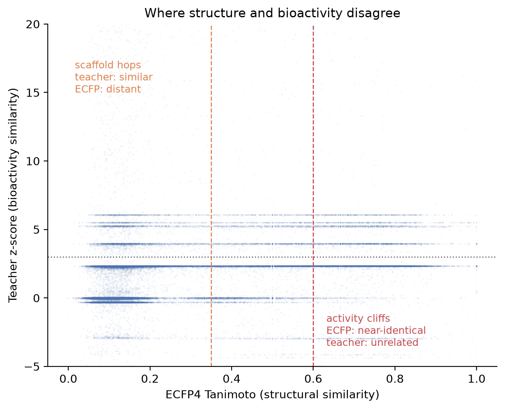
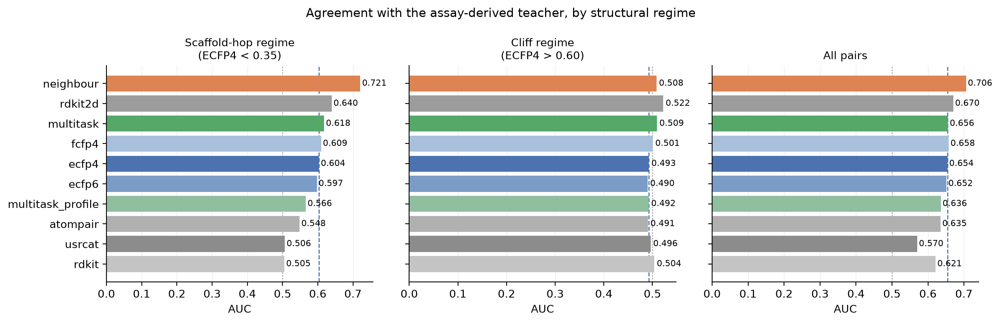

# 2026-07-18 — A ligand-only fingerprint for bioactivity similarity

## Summary

Bioactivity fingerprints — representations built from what a compound *does* in
assays rather than what it looks like — find relationships that structural
fingerprints miss, especially scaffold hops. Their defect is that they only exist
for compounds someone has already screened. This entry asks whether that
representation can be **distilled into a ligand-only fingerprint**, computable
from structure alone for any molecule.

Ground truth comes from all of ChEMBL 37. The answer, across three evaluations,
is **no — and the training-free control wins**. Inheriting a measured profile
from structural neighbours (the Bioturbo idea, 2013) beats every trained model
tested, beats every structural fingerprint, and is the only method meaningfully
above baseline where it matters. Neural distillation did not merely fail to help;
the better-resourced variant was *worse*.

## Why the obvious metric is the wrong one

Structure and bioactivity are already correlated, so a structural fingerprint
reproduces most of a bioactivity similarity matrix for free. A student trained to
imitate a bioactivity fingerprint therefore scores well on average even if it has
learned nothing beyond ECFP — and that failure is invisible under a global
correlation.

What makes a bioactivity fingerprint valuable is precisely where it *disagrees*
with structural similarity: **scaffold hops** (teacher says similar, ECFP says
distant) and **activity cliffs** (ECFP says near-identical, teacher does not). So
the evaluation conditions on that disagreement and reports ECFP as a control on
the same restricted pair sets.

## Results

588,356 test pairs, scaffold-disjoint split, 152,730 compounds. AUC for
separating bioactively-related pairs (teacher z ≥ 3); ECFP4 is the reference
every method has to beat.

| method | scaffold-hop AUC | cliff AUC | all-pairs AUC |
| --- | --- | --- | --- |
| **neighbour** (Bioturbo, no training) | **0.721** | 0.508 | **0.706** |
| rdkit2d descriptors | 0.640 | 0.522 | 0.670 |
| multitask student (512-dim embedding) | 0.618 | 0.509 | 0.656 |
| fcfp4 | 0.609 | 0.501 | 0.658 |
| ecfp4 | 0.604 | 0.493 | 0.654 |
| ecfp6 | 0.597 | 0.490 | 0.652 |
| multitask student (7,189-dim profile head) | 0.566 | 0.492 | 0.636 |
| atompair | 0.548 | 0.491 | 0.635 |
| usrcat (3D shape+colour) | 0.506 | 0.496 | 0.570 |
| rdkit fingerprint | 0.505 | 0.504 | 0.621 |

**1. The training-free control wins, decisively.** Inheriting a similarity-weighted
profile from the 25 nearest structural neighbours scores 0.721 against ECFP4's
0.604 — the only method that is not a rounding error away from the structural
baselines. It needs no training, is fully interpretable, and works for any
molecule. This reproduces Wassermann's Bioturbo result at ChEMBL-37 scale.

**2. Distillation failed, and the confound is ruled out.** Round one compared a
512-dim learned embedding against a 7,189-dim inherited profile, which confounds
*how* the representation was obtained with *how wide* it is. Scoring the model's
own profile head at the same 7,189 dimensions settles it: **0.566, worse than the
narrow embedding (0.618) and worse than ECFP4 (0.604)**. Giving the trained model
the teacher's exact output space made it worse, so the neighbour advantage is not
a width artefact. The likely cause is that supervision is spread over 7,189
targets with ~940k labels — most targets are near-empty, so the predicted profile
collapses onto a few well-populated dimensions.

**3. Nothing resolves activity cliffs.** Every method sits at chance (0.490–0.522).
This is the regime where structural similarity is actively misleading, and no
representation tested — structural, 3D, learned, or inherited — beats a coin flip.

**4. Plain 2D descriptors are a surprisingly strong bioactivity baseline.** RDKit's
physicochemical block (0.640) beats every circular fingerprint and both trained
students. Worth noting this only emerged after fixing a bug: the `Ipc` descriptor
overflows float32 to `inf`, which had silently produced NaN Spearman and exactly
0.500 AUC. The first run's "rdkit2d is useless" reading was an artefact.

### Transfer to an independent benchmark

The intrinsic evaluation lives entirely inside ChEMBL, so a good score there
partly reflects reproducing ChEMBL's assay structure. As an external check the
frozen student was used as features on the 16 ADMET/potency endpoints from the
[2026-07-11 entry](../2026-07-11-implicit-geometry-similarity/), under those
datasets' own non-random splits, same downstream model (RF).

| features | mean Spearman (16 endpoints) |
| --- | --- |
| ECFP4 | **0.534** |
| distilled student | 0.436 |
| ECFP4 + student | 0.464 |

The student transfers *worse* than plain ECFP4, and concatenating it **degrades**
ECFP4 rather than adding to it — dense continuous features win random-forest
splits over sparse binary ones by chance. This lands the student in the same band
as POTS (0.455) from the previous entry: another representation that is
interesting but does not beat ECFP on accuracy.

## Data and curation

ChEMBL 37 SQLite (2,921,148 compounds; 24,527,044 activities). Curation follows
Landrum & Riniker (*JCIM* 2024, 64, 1560,
[doi](https://doi.org/10.1021/acs.jcim.4c00049)), who found that with minimal
curation 27% of IC50 pairs for the same compound-target pair disagree by more
than one log unit.

Three filter choices that are not the defaults:

| Choice | Why |
| --- | --- |
| `confidence_score = 9`, not `>= 8` | Score 8 is also assigned when the species is undefined, so the target assignment is a guess. Nearly free: the tiers are disjoint and 9 is the larger (892k vs 342k IC50 records). |
| Potency types kept separate | Ki is *not* more reproducible than IC50 across sources (curated MAE 0.45 vs 0.27), removing the usual justification for pooling. |
| Censored `">"` records retained | `pchembl_value` is populated only for `=`, so the standard filter silently drops every measurement establishing a compound is *inactive*. |

Yield: **1,389,026 exact-value activities** (759,256 compounds, 7,189 targets,
6,403 assay-condition groups) plus **222,654 censored inactives**.

## The sparsity problem, and what it forced

| targets per compound | compounds |
| --- | --- |
| 1 | 708,951 |
| 2 | 188,086 |
| 3–4 | 93,867 |
| 5–9 | 17,355 |
| 10–19 | 2,234 |
| 20+ | 1,187 |

About 70% of compounds carry a single target annotation, so overlap-based
similarity is degenerate for most of the data. Relating the *targets* is what
rescues those pairs — load-bearing, not a refinement.

The relatedness must not come from ligand chemistry. SEA (Keiser et al.,
*Nat Biotechnol* 2007, 25, 197) derives target-target similarity from the Tanimoto
overlap of ligand sets; using that here would inject structural similarity into a
ground truth used to score a structure-only model, inflating the result for free.
Both sources used are independent of ligand structure: MMseqs2 all-vs-all sequence
identity, and shared depth in ChEMBL's protein class hierarchy. Requiring three
shared levels matters — scoring any shared lineage related 32% of all target
pairs; the filtered matrix is 1.3% dense. Targets are IDF-weighted so that
sharing a heavily-screened target counts for less than sharing a rare one.

## Honest limitations

- **The teacher is quantized.** The banding in the first figure is real: compounds
  with one or two annotations admit only a handful of distinct cosine values, so a
  large fraction of pairs are tied. AUC is reported as the headline for this
  reason; Spearman is depressed by ties and should not be read as a clean effect
  size.
- **Missing ≠ inactive.** ChEMBL records only what was measured. Supervision is
  masked accordingly, but the teacher still inherits the literature's choices
  about what to screen — two compounds can look bioactively similar because they
  were profiled on the same panel.
- **One student architecture.** A masked multi-task MLP on ECFP counts. A GNN, a
  pretrained SMILES encoder, or the pair-similarity distillation objective
  (implemented in `student.train_distill`, not yet run) might do better. The
  claim here is that the obvious approach loses to a training-free control, not
  that no network can win.
- **No frequent-hitter filtering.** Aggregators are enriched in the literature and
  Tanimoto-transferable (Irwin et al., *J Med Chem* 2015, 58, 7076), so some
  "bioactive similarity" is likely shared assay artefact.
- The transfer benchmark used RF only, without the Gaussian-process variants that
  performed best in the previous entry.

## Prior art

- **HTS fingerprints.** Petrone et al. (*ACS Chem Biol* 2012, 7, 1399) — compounds
  as z-scored responses across 195 Novartis assays. Helal et al. (*JCIM* 2016, 56,
  390, [doi](https://doi.org/10.1021/acs.jcim.5b00498)) built the public version
  from 243 PubChem bioassays over >300k compounds.
- **Bioturbo** — Wassermann et al. (*JCIM* 2013, 53, 692): use chemical similarity
  to map an unannotated molecule into bioactivity space, then search there. This
  is the control that won.
- **Predicted affinity fingerprints** — Škuta et al. (*J Cheminform* 2020, 12, 39):
  440-element RF-predicted affinity fingerprint from public ChEMBL. Closest prior
  work to the student here.
- **Profile-QSAR** — Martin et al. (*JCIM* 2019, 59, 4450): median r² 0.53 across
  8,558 assays vs 0.05 for single-assay RF, and the source of the warning that
  random splits massively overstate accuracy on a bioactivity matrix.

## Next steps

- Run the pair-similarity distillation objective (`--distill`), which optimises
  embedding similarity against teacher similarity directly rather than via a
  profile proxy — the one rung of the ladder not yet tested.
- Fuse rather than replace: Riniker et al. (*JCIM* 2014, 54, 1880) found
  heterogeneous fusion of HTSFP and chemical models beat either alone on *all*
  assays. Given that the neighbour control and ECFP4 fail on different pairs,
  fusion is the obvious next move and is better motivated than a bigger network.
- Restrict the teacher to the ~21k compounds with ≥5 annotations and re-run. The
  quantization above is the main thing limiting what any student can learn.
